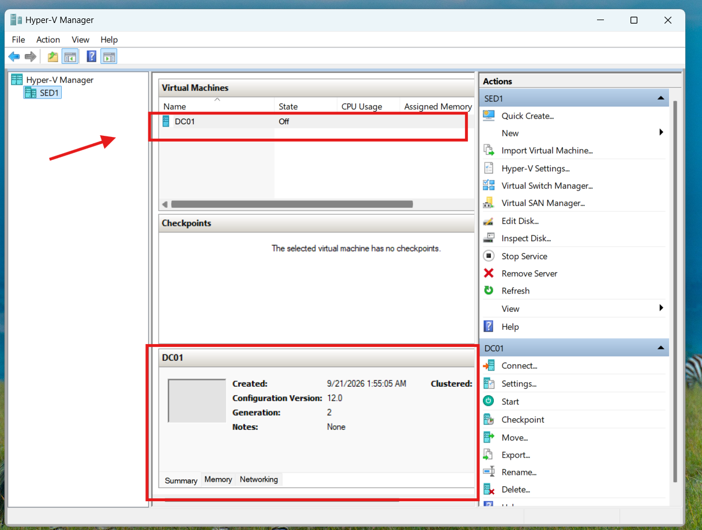
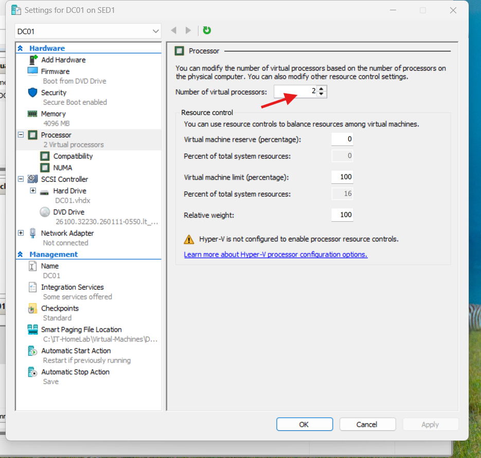

# BluePeak Technologies — DC01 Virtual Machine Setup

## Project overview

BluePeak Technologies is a fictional company used to simulate an enterprise IT environment. This lab will support hands-on practice with Windows Server, Active Directory, identity and access management (IAM), and Help Desk troubleshooting.

## Objective

Create a Windows Server virtual machine named DC01 that will later be configured as the company's Active Directory domain controller.

## Lab environment

* Host computer: Dell Latitude 5530
* Host operating system: Windows 11 Pro
* Virtualization platform: Microsoft Hyper-V
* Guest operating system: Windows Server 2025 Evaluation

## Virtual machine configuration

| Setting              | Configuration                      |
| -------------------- | ---------------------------------- |
| Virtual machine name | DC01                               |
| Generation           | Generation 2                       |
| Startup memory       | 4096 MB (4 GB)                     |
| Dynamic Memory       | Disabled                           |
| | Virtual processors | 2 |                 |
| Network connection   | Not Connected                      |
| Virtual hard disk    | DC01.vhdx                          |
| Maximum disk size    | 80 GB                              |
| Installation media   | Windows Server 2025 Evaluation ISO |

## Implementation

1. Enabled Hyper-V on Windows 11 Pro.
2. Created the IT home lab folder structure.
3. Downloaded the Windows Server 2025 Evaluation ISO.
4. Used Hyper-V Manager to create a Generation 2 virtual machine named DC01.
5. Allocated 4 GB of startup memory and disabled Dynamic Memory.
6. Left networking disconnected pending creation of a dedicated lab virtual switch.
7. Created an 80 GB virtual hard disk and attached the Windows Server installation ISO.
8. Reviewed the configuration and completed the VM creation wizard.
9. Opened DC01's Hyper-V settings and changed the
   virtual processor allocation from 6 to 2.
## Verification

DC01 was successfully created and appeared in Hyper-V Manager. The virtual machine has not yet been started, and Windows Server has not yet been installed.

## Evidence

## Next steps

* Verify and configure DC01's virtual processor allocation.
* Create a dedicated virtual network.
* Install Windows Server 2025.
* Configure Active Directory Domain Services and DNS.

## Skills demonstrated

Hyper-V administration, virtual machine provisioning, Windows Server installation planning, infrastructure documentation, and lab environment design.
