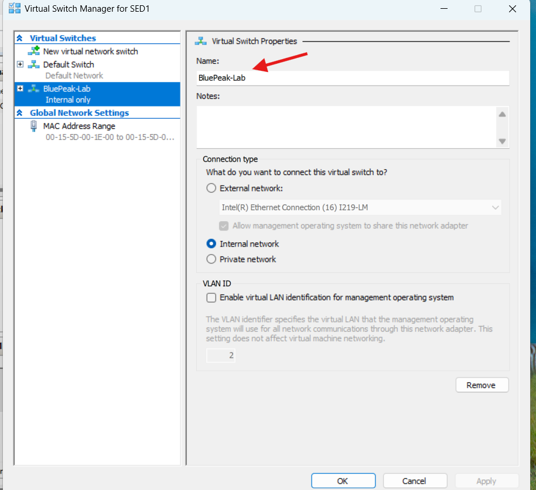
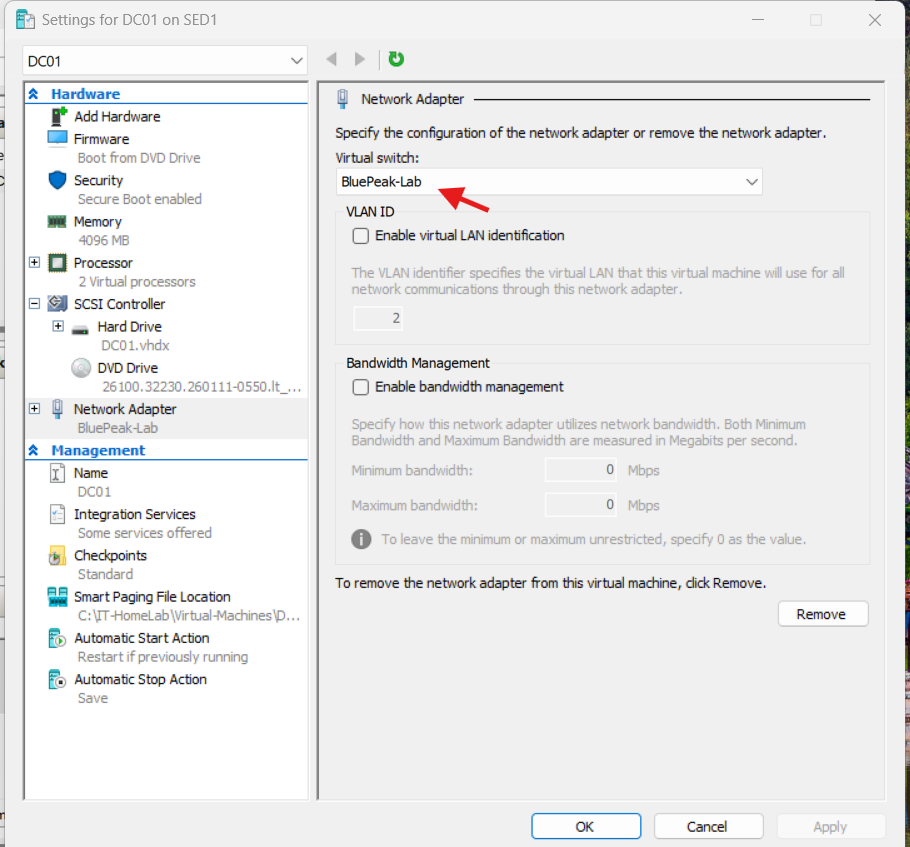

# BluePeak Technologies — Virtual Network Setup

## Objective

Create a dedicated virtual network for the BluePeak Technologies IT home lab.

The network will allow the domain controller and future client workstations to communicate without directly connecting the lab to the physical home network.

## Virtual switch configuration

| Setting | Configuration |
|---|---|
| Virtualization platform | Microsoft Hyper-V |
| Switch name | BluePeak-Lab |
| Switch type | Internal |
| Internet access | Not configured |
| Connected virtual machines | DC01 |

## Implementation

1. Opened Hyper-V Manager.
2. Opened Virtual Switch Manager.
3. Selected New virtual network switch.
4. Chose the Internal switch type.
5. Named the switch BluePeak-Lab.
6. Applied the configuration.
7. Opened DC01's Hyper-V settings and connected
   its network adapter to BluePeak-Lab.

## Why I selected an Internal switch

An Internal Hyper-V switch supports communication between virtual machines connected to the switch and the Windows host.

This allows me to build a controlled lab environment for Active Directory, DNS, Group Policy, and Help Desk troubleshooting without directly bridging the virtual machines onto my physical home network.

An Internal switch does not automatically provide internet access. Internet connectivity can be configured separately if required.

## Verification

Successfully created the BluePeak-Lab switch in Hyper-V Virtual Switch Manager and confirmed that its connection type was Internal.

Connectivity between virtual machines has not yet been tested.

Confirmed that DC01's virtual network adapter is assigned to BluePeak-Lab. Network connectivity has not yet been tested.

## Evidence

## Next steps

- Install Windows Server 2025.
- Configure static IP addressing.
- Configure Active Directory Domain Services and DNS.
- Create and connect a Windows client virtual machine.

## Skills demonstrated

- Hyper-V virtual networking
- Virtual switch configuration
- Lab network design
- Network isolation planning
- Technical documentation