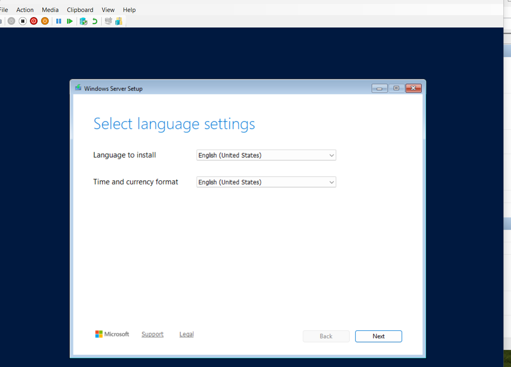
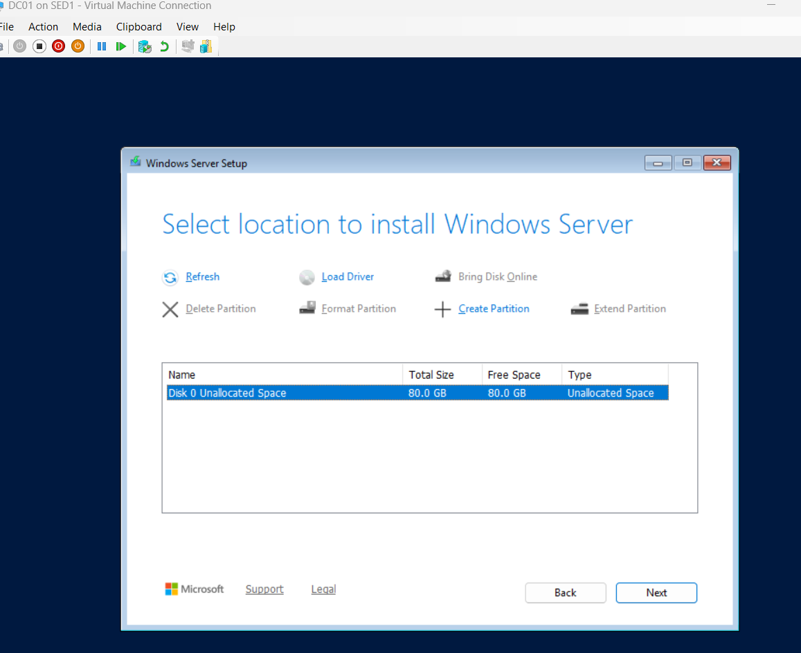
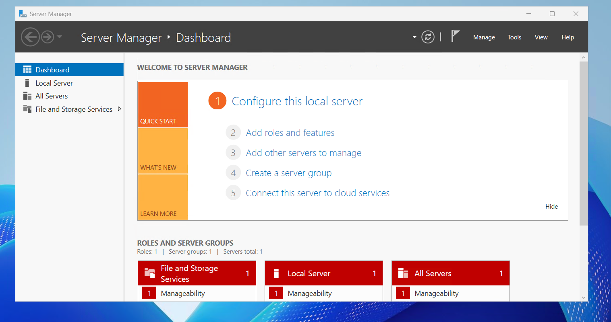

# DC01 Windows Server 2025 Installation

## Project Overview

As part of the BluePeak Technologies IT Home Lab, I deployed Windows Server 2025 on the DC01 virtual machine using Microsoft Hyper-V.

DC01 will serve as the primary server for the BluePeak Technologies lab environment and will later be configured with Active Directory Domain Services (AD DS), DNS, and other enterprise services.

## Server Configuration

- Server Name: DC01
- Hypervisor: Microsoft Hyper-V
- Operating System: Windows Server 2025 Standard Evaluation
- Installation Type: Desktop Experience
- Generation: Generation 2
- Startup Memory: 4096 MB
- Dynamic Memory: Disabled
- Virtual Processors: 2
- Virtual Hard Disk: 80 GB VHDX
- Virtual Switch: BluePeak-Lab
- Network Type: Internal

## Windows Server Installation

The Windows Server 2025 ISO was attached to the virtual DVD drive of DC01.

During installation:

1. Windows Server 2025 Standard Evaluation (Desktop Experience) was selected.
2. The 80 GB unallocated virtual disk was selected as the installation destination.
3. Windows Setup created the required system partitions automatically.
4. Windows Server completed installation successfully.
5. A password was configured for the built-in Administrator account.
6. The first Administrator sign-in completed successfully.
7. Server Manager launched after sign-in.

## Installation Verification

The successful installation was verified by:

- Successful boot into Windows Server 2025
- Successful Administrator sign-in
- Windows Server desktop loaded correctly
- Server Manager launched successfully

## Screenshots

### Windows Server Installer

### Installation Disk

### Server Manager After Installation

## Troubleshooting Experience

During the initial boot attempt, Hyper-V displayed a UEFI Virtual Machine Boot Summary indicating that the DVD boot loader failed and no operating system was loaded.

The following items were verified during troubleshooting:

- Windows Server ISO was attached to the virtual DVD drive.
- Secure Boot was enabled using the Microsoft Windows template.
- The DVD drive was first in the VM firmware boot order.
- The Windows Server ISO was approximately 7.59 GB.
- The ISO mounted successfully on the Windows host.
- The ISO contained the EFI boot file `efi\boot\bootx64.efi`.
- The VM was restarted and the Windows Server installation media booted successfully.

The successful retry indicated that the original issue may have been related to the boot-from-DVD prompt timing. Because the exact cause was not independently confirmed, no unsupported root cause was recorded.

## Result

DC01 was successfully deployed with Windows Server 2025 Standard Evaluation (Desktop Experience) and is ready for post-installation server configuration.