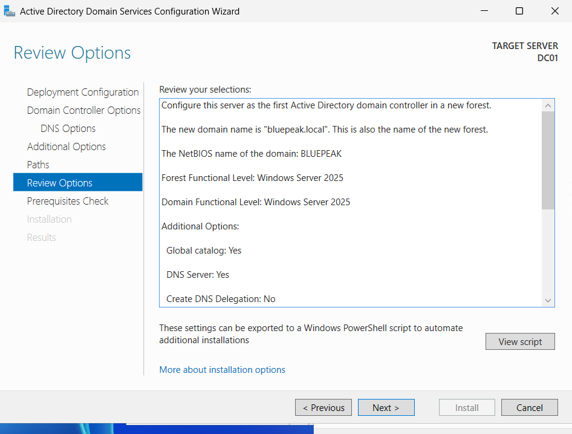

# Active Directory Domain Services Deployment

## Project Overview

As part of the BluePeak Technologies IT Home Lab, I installed Active Directory Domain Services (AD DS) on DC01 and promoted the server to the first domain controller in a new Active Directory forest.

The environment was configured with the fictional internal Active Directory domain:

`bluepeak.local`

This provides the foundation for centralized identity management, authentication, DNS, users, groups, computers, Organizational Units, and Group Policy within the BluePeak Technologies lab.

## Domain Controller

- Server Name: DC01
- IPv4 Address: 10.10.10.10
- Active Directory Domain: bluepeak.local
- NetBIOS Domain Name: BLUEPEAK
- Domain Controller: DC01
- DNS Server: Enabled
- Global Catalog: Enabled
- Read-Only Domain Controller (RODC): No

## AD DS Role Installation

The Active Directory Domain Services role was installed through Server Manager using the Add Roles and Features Wizard.

The installation type selected was:

`Role-based or feature-based installation`

DC01 was selected as the destination server, and the required AD DS management tools and supporting features were added automatically.

The AD DS role installation completed successfully.

## New Active Directory Forest

After installing the AD DS role, DC01 was promoted to a domain controller.

Because this was a new Active Directory environment, the following deployment option was selected:

`Add a new forest`

The root domain name was configured as:

`bluepeak.local`

Windows automatically generated the NetBIOS domain name:

`BLUEPEAK`

## Domain Controller Options

DC01 was configured with:

- DNS Server: Enabled
- Global Catalog (GC): Enabled
- Read-Only Domain Controller (RODC): Disabled
- Directory Services Restore Mode (DSRM) password: Configured securely

The DSRM password is intentionally not included in this documentation.

## DNS Delegation

During promotion, the wizard displayed a DNS delegation warning.

No DNS delegation was created because `bluepeak.local` is a new isolated lab forest and there is no existing authoritative parent DNS infrastructure requiring delegation.

## Active Directory Paths

The default Active Directory paths were used:

```text
Database folder:  C:\Windows\NTDS
Log files folder: C:\Windows\NTDS
SYSVOL folder:    C:\Windows\SYSVOL
```

## Prerequisite Check

Before promotion, the Active Directory Domain Services Configuration Wizard performed a prerequisite check.

The result was:

`All prerequisite checks passed successfully.`

DC01 was then promoted to a domain controller and restarted.

## Post-Promotion Verification

After the restart, the Windows sign-in screen displayed:

`Sign in to: BLUEPEAK`

A successful sign-in was completed using the BLUEPEAK domain Administrator account.

Active Directory Users and Computers (ADUC) was then opened from Server Manager.

The following domain was successfully displayed:

`bluepeak.local`

This verified that the Active Directory domain was created and accessible through the AD DS management tools.

## Screenshot Evidence

### AD DS Configuration Review



### Active Directory Domain Verification


## Result

DC01 was successfully promoted to the first domain controller for the BluePeak Technologies Active Directory environment.

The lab now has an operational Active Directory forest and domain:

`bluepeak.local`

The next phase of the project will focus on designing the organizational structure and implementing Organizational Units, users, security groups, computers, and identity-management tasks.