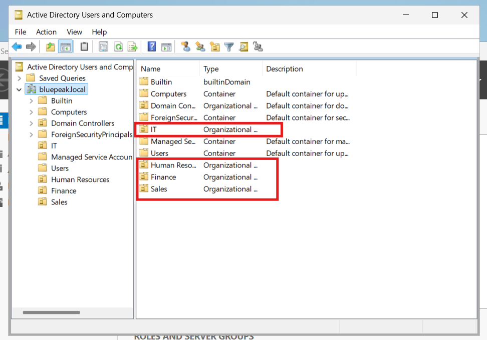
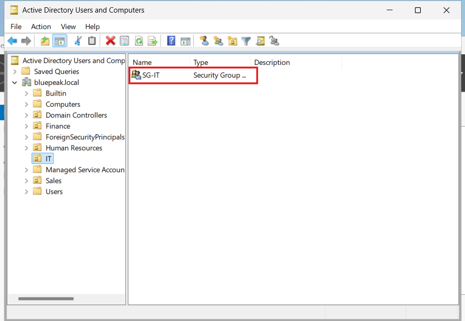
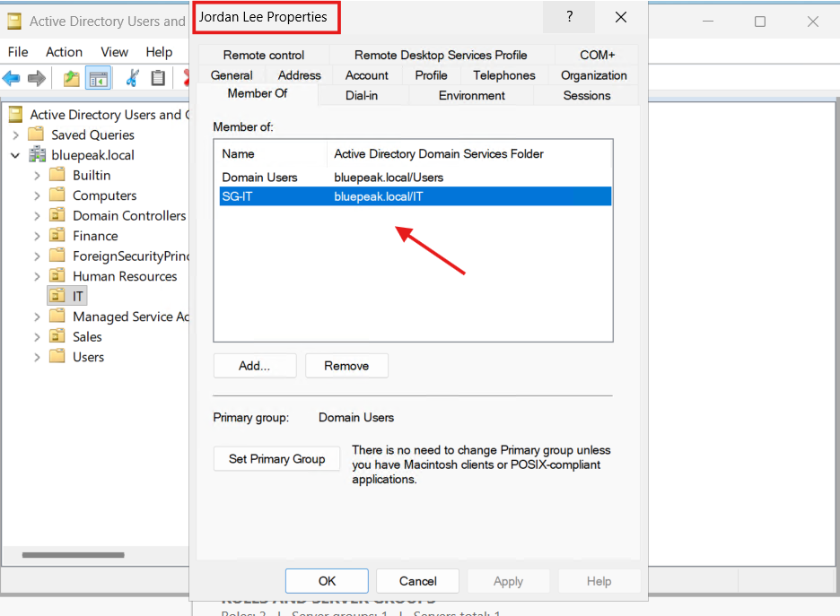

# Active Directory Organizational Structure, Users, and Security Groups

## Project Overview

As part of the BluePeak Technologies IT Home Lab, I designed and implemented an Active Directory organizational structure for four fictional business departments.

The objective was to simulate common Help Desk and Identity and Access Management (IAM) tasks, including:

- Organizational Unit (OU) creation
- User account provisioning
- Security group creation
- Department-based group membership
- Role-Based Access Control (RBAC)
- New-user password configuration

## Active Directory Environment

- Domain: bluepeak.local
- NetBIOS Domain: BLUEPEAK
- Domain Controller: DC01
- Domain Controller IP: 10.10.10.10

## Organizational Unit Structure

Four department Organizational Units were created directly under the `bluepeak.local` domain:

```text
bluepeak.local
├── IT
├── Human Resources
├── Finance
└── Sales
```

The Organizational Units were protected from accidental deletion.

## Department Security Groups

A Global Security group was created for each department:

| Department | Security Group | Group Scope | Group Type |
|---|---|---|---|
| IT | SG-IT | Global | Security |
| Human Resources | SG-HR | Global | Security |
| Finance | SG-Finance | Global | Security |
| Sales | SG-Sales | Global | Security |

The `SG-` naming convention identifies these objects as security groups.

## User Provisioning

One fictional employee account was created for each department:

| Department | Employee | User Logon Name | Security Group |
|---|---|---|---|
| IT | Jordan Lee | jordan.lee | SG-IT |
| Human Resources | Maya Patel | maya.patel | SG-HR |
| Finance | Daniel Kim | daniel.kim | SG-Finance |
| Sales | Sophia Martinez | sophia.martinez | SG-Sales |

Each user account was created inside its corresponding department OU.

## New-User Password Configuration

Each user was assigned an initial lab password during account provisioning.

The following option was enabled:

`User must change password at next logon`

This simulates a common employee onboarding process where an administrator creates an account with a temporary password and requires the employee to establish a new password during first sign-in.

Passwords are intentionally excluded from this documentation and from the GitHub repository.

## Role-Based Access Control

Department access was designed around security-group membership rather than assigning department permissions directly to individual users.

The following mappings were implemented:

```text
Jordan Lee       → SG-IT
Maya Patel       → SG-HR
Daniel Kim       → SG-Finance
Sophia Martinez  → SG-Sales
```

All four users also retain their standard `Domain Users` membership.

This group-based approach provides a foundation for Role-Based Access Control (RBAC). Resources can be assigned to department security groups, allowing access to be managed by adding or removing users from the appropriate groups.

For example:

```text
User → Department Security Group → Resource Permission
```

This makes access management more scalable and easier to audit than assigning resource permissions individually to each user.

## Final Active Directory Structure

```text
bluepeak.local
├── IT
│   ├── SG-IT
│   └── Jordan Lee (jordan.lee)
│
├── Human Resources
│   ├── SG-HR
│   └── Maya Patel (maya.patel)
│
├── Finance
│   ├── SG-Finance
│   └── Daniel Kim (daniel.kim)
│
└── Sales
    ├── SG-Sales
    └── Sophia Martinez (sophia.martinez)
```

## Screenshot Evidence

### Department Organizational Units



### IT Security Group



### User Security Group Membership



## Skills Demonstrated

This portion of the project demonstrates hands-on experience with:

- Active Directory Users and Computers (ADUC)
- Organizational Unit administration
- User account provisioning
- Security group administration
- Global Security groups
- Department-based access management
- Role-Based Access Control concepts
- New-employee onboarding
- Active Directory naming conventions
- Identity lifecycle fundamentals
- Technical documentation

## Result

BluePeak Technologies now has a structured Active Directory environment containing four departmental Organizational Units, four department security groups, and four fictional employee accounts.

Each employee was assigned to the appropriate department security group, establishing the foundation for future resource permissions, access-control testing, Help Desk troubleshooting, IAM workflows, and Group Policy administration.