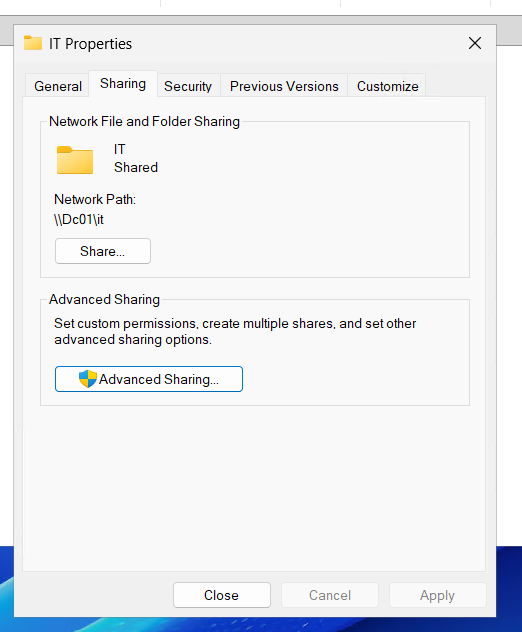
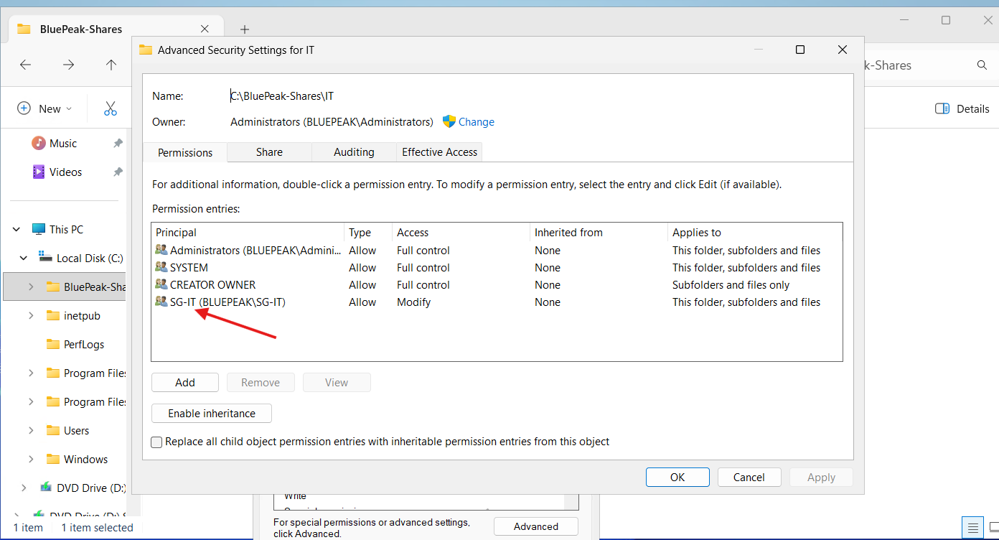

# Department Shared Folders and Access Permissions

## Project Overview

As part of the BluePeak Technologies IT Home Lab, I created departmental shared folders and configured access using Active Directory security groups.

The objective was to simulate common Help Desk, system administration, and Identity and Access Management (IAM) tasks involving:

- Department network shares
- NTFS permissions
- Share permissions
- Permission inheritance
- Active Directory security groups
- Role-Based Access Control (RBAC)
- Access troubleshooting

## Environment

- Domain: bluepeak.local
- NetBIOS Domain: BLUEPEAK
- Domain Controller: DC01
- Domain Controller IP: 10.10.10.10
- File Server: DC01
- Parent Folder: `C:\BluePeak-Shares`

## Department Folder Structure

The following departmental folders were created:

```text
C:\BluePeak-Shares
├── IT
├── Human Resources
├── Finance
└── Sales
```

Each folder represents a shared resource for a BluePeak Technologies department.

## NTFS Permission Design

The departmental folders were configured using department-based Active Directory security groups.

For each department folder:

1. NTFS permission inheritance was disabled.
2. Existing inherited permissions were converted into explicit permissions.
3. General `BLUEPEAK\Users` entries were removed.
4. The appropriate department security group was added.
5. The department security group was granted `Modify` permission.
6. Administrative and system permissions were retained.

The resulting configuration was:

| Department | Security Group | NTFS Permission |
|---|---|---|
| IT | SG-IT | Modify |
| Human Resources | SG-HR | Modify |
| Finance | SG-Finance | Modify |
| Sales | SG-Sales | Modify |

`Full Control` was not granted to the department security groups.

## Why Modify Permission Was Used

The `Modify` permission allows department users to perform normal file-management tasks such as:

- Read files
- Create files and folders
- Edit files
- Write data
- Delete files and folders

Users were not granted `Full Control`, which would provide additional administrative capabilities such as changing permissions.

This follows the principle of providing the access required to perform a job without unnecessarily granting administrative control over the resource.

## NTFS Permission Inheritance

By default, the department folders inherited permissions from their parent location.

Inheritance was disabled on each departmental folder so that access could be controlled independently.

When inheritance was disabled, existing inherited permissions were converted into explicit permissions before unnecessary general-user entries were removed.

This provided a controlled starting point while preserving important administrative entries such as `SYSTEM` and `Administrators`.

## Network Share Configuration

Each departmental folder was configured as a Windows network share.

The default `Everyone` share permission was removed and replaced with the corresponding department security group.

The following share permissions were configured:

| Department | Security Group | Share Permission |
|---|---|---|
| IT | SG-IT | Change + Read |
| Human Resources | SG-HR | Change + Read |
| Finance | SG-Finance | Change + Read |
| Sales | SG-Sales | Change + Read |

`Full Control` was not granted at the share level.

## Network Paths

The departmental resources are available through the following UNC paths:

```text
\\DC01\IT
\\DC01\Human Resources
\\DC01\Finance
\\DC01\Sales
```

A UNC path allows users and administrators to access shared network resources by referencing the server and share name.

## NTFS Permissions vs. Share Permissions

Windows can evaluate two permission layers when a shared folder is accessed across the network:

```text
User
  ↓
Active Directory Security Group
  ↓
Share Permission
  ↓
NTFS Permission
  ↓
Department Resource
```

For example:

```text
Jordan Lee
   ↓
SG-IT
   ↓
Share: Change + Read
   ↓
NTFS: Modify
   ↓
\\DC01\IT
```

NTFS permissions control access to the files and folders on the NTFS filesystem.

Share permissions control access when the resource is accessed through the network share.

When network access is evaluated, the effective access is constrained by the applicable permission layers.

## Role-Based Access Control

Permissions were assigned to department security groups instead of directly to individual employees.

The access model is:

```text
User → Department Security Group → Resource Permission
```

Current department mappings:

```text
Jordan Lee       → SG-IT       → IT
Maya Patel       → SG-HR       → Human Resources
Daniel Kim       → SG-Finance  → Finance
Sophia Martinez  → SG-Sales    → Sales
```

This approach makes access easier to manage and audit.

If an employee changes departments, access can be updated through security-group membership rather than manually changing permissions on every resource.

## Access Testing

An initial access test was performed while signed in as:

```text
BLUEPEAK\Administrator
```

The following UNC path was tested:

```text
\\DC01\IT
```

Access was denied.

The Administrator account's Active Directory group memberships were reviewed, and `SG-IT` was not present.

Because the IT share had been intentionally restricted to `SG-IT`, this result was consistent with the configured department-based access model.

Rather than adding the Administrator account to `SG-IT` simply to make the test succeed, the environment will use a domain-joined client workstation to test access with actual department user accounts.

For example:

```text
Jordan Lee → SG-IT → \\DC01\IT
```

This will provide a more realistic test of the RBAC configuration.

## Troubleshooting Scenario — Sales Folder Configuration

During configuration of the Sales departmental resource, the parent folder:

```text
C:\BluePeak-Shares
```

was accidentally selected instead of:

```text
C:\BluePeak-Shares\Sales
```

As a result:

- The parent `BluePeak-Shares` folder was temporarily shared.
- `SG-Sales` was temporarily granted `Modify` NTFS permission on the parent folder.

The issue was identified by reviewing the object path and network share path.

The incorrect configuration showed:

```text
C:\BluePeak-Shares
\\DC01\BluePeak-Shares
```

instead of the intended Sales resource:

```text
C:\BluePeak-Shares\Sales
\\DC01\Sales
```

### Corrective Actions

The following corrective actions were performed:

1. Disabled sharing on the `BluePeak-Shares` parent folder.
2. Removed the accidental `SG-Sales` NTFS permission from the parent folder.
3. Applied and verified the corrected parent-folder permissions.
4. Opened the actual `C:\BluePeak-Shares\Sales` folder.
5. Verified the object path before making changes.
6. Disabled inheritance on the correct Sales folder.
7. Removed the general `BLUEPEAK\Users` permissions.
8. Added `SG-Sales`.
9. Granted `SG-Sales` NTFS `Modify`.
10. Shared the Sales folder as `Sales`.
11. Removed the default `Everyone` share permission.
12. Granted `SG-Sales` `Change + Read` share permissions.
13. Verified the final network path as `\\DC01\Sales`.

This troubleshooting exercise demonstrated the importance of verifying the target object before modifying permissions and validating both NTFS and network-share configurations after making changes.

## Screenshot Evidence

### IT Network Share



This screenshot demonstrates the configured IT network share and the `\\DC01\IT` network path.

### IT NTFS Permissions



This screenshot demonstrates the `SG-IT` security group receiving `Modify` permission on the IT department folder.

## Skills Demonstrated

This portion of the project demonstrates hands-on experience with:

- Windows file and folder administration
- NTFS permissions
- NTFS permission inheritance
- Explicit permissions
- Windows network shares
- Share permissions
- UNC network paths
- Active Directory security groups
- Role-Based Access Control (RBAC)
- Least-privilege concepts
- Department-based access management
- Access-denied troubleshooting
- Permission verification
- Configuration-error identification and remediation
- Technical documentation

## Result

BluePeak Technologies now has four department-specific network resources protected through Active Directory security groups.

Each department security group has:

```text
NTFS Permission:  Modify
Share Permission: Change + Read
```

The completed configuration establishes the foundation for testing authorized and unauthorized access from a domain-joined Windows client.

The next phase of the project will use `CLIENT01` to simulate an employee workstation, join it to the `bluepeak.local` domain, and validate the department access-control model with BluePeak user accounts.