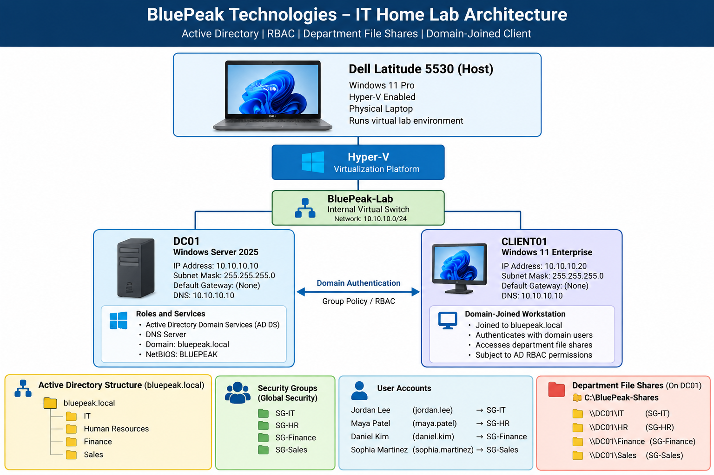
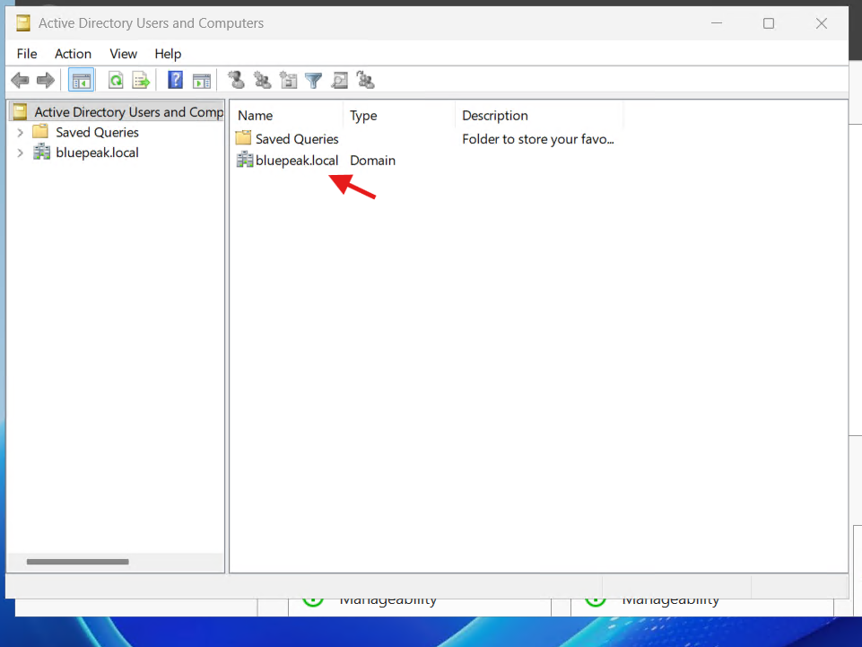
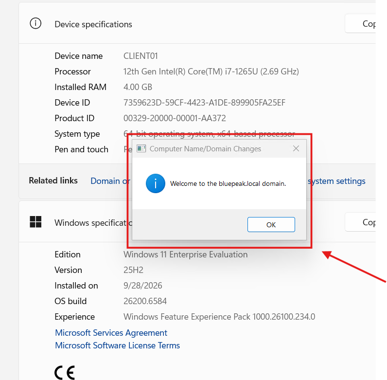
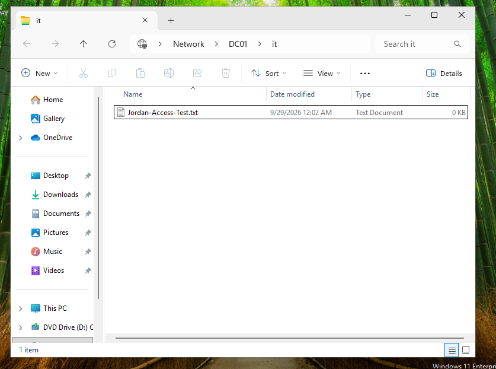
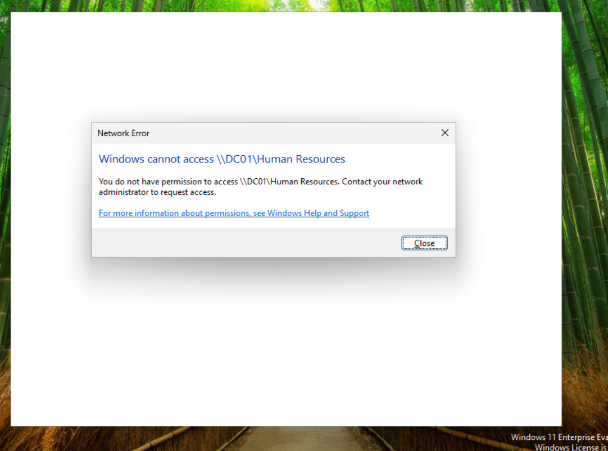
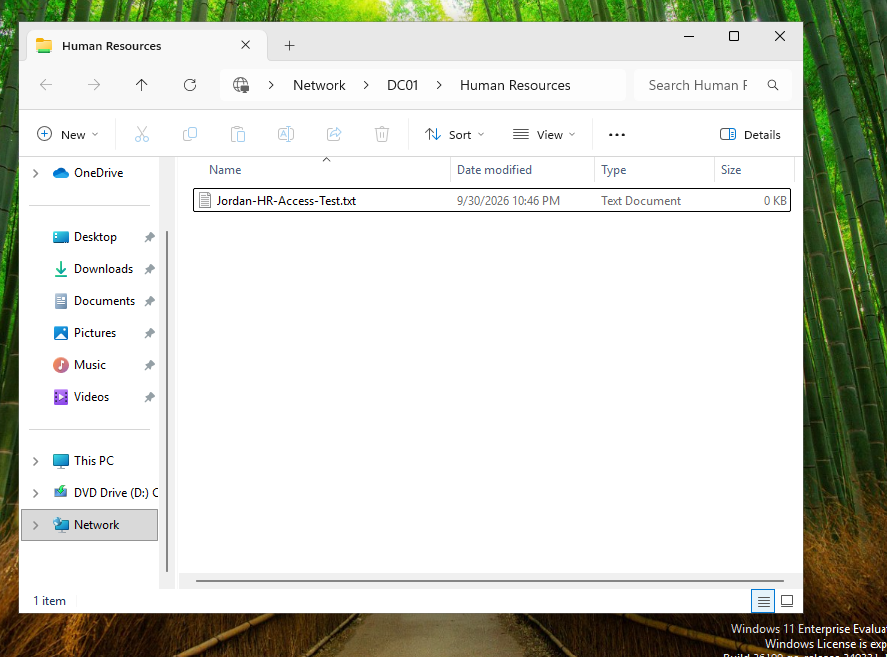
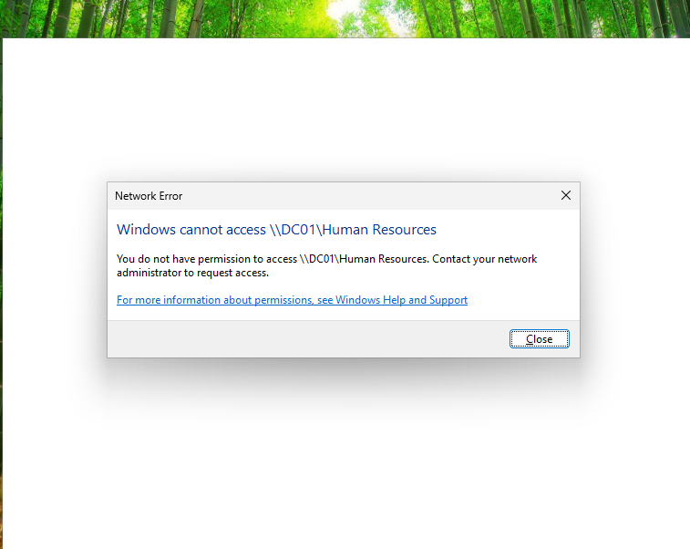

# BluePeak Technologies — IT Home Lab

A hands-on IT infrastructure and Help Desk lab simulating a small business environment using **Windows Server 2025, Active Directory, DNS, Hyper-V, Windows 11, Role-Based Access Control (RBAC), and SMB file sharing**.

This project demonstrates the deployment and administration of a Windows domain environment, including user and group management, domain-joined workstations, departmental resource permissions, IAM access management, and real-world Help Desk troubleshooting.

## 🎥 Project Walkthrough Video

> **Coming Soon:** A 5–6 minute walkthrough demonstrating the BluePeak Technologies lab environment, Active Directory configuration, RBAC implementation, domain client, and Help Desk access troubleshooting scenario.

## 🏗️ Lab Architecture

## 🎯 Project Objectives

The goal of this project was to build and administer a realistic Windows business environment while developing practical **IT Support, System Administration, and Identity & Access Management (IAM)** skills.

Key objectives included:

- Deploy a Windows Server domain controller using Hyper-V
- Configure Active Directory Domain Services (AD DS) and DNS
- Design departmental Organizational Units (OUs), users, and security groups
- Implement Role-Based Access Control (RBAC) for departmental resources
- Configure secure SMB network shares using NTFS and share permissions
- Deploy and join a Windows 11 workstation to the domain
- Authenticate and test access using standard domain user accounts
- Troubleshoot a realistic Help Desk access incident
- Provision, verify, and revoke temporary user access
- Document the environment and troubleshooting process for a technical portfolio

- ## 💻 Lab Environment

| Component | Configuration |
|---|---|
| Host Computer | Dell Latitude 5530 |
| Host OS | Windows 11 Pro |
| Virtualization | Microsoft Hyper-V |
| Domain Controller | DC01 — Windows Server 2025 |
| Client Workstation | CLIENT01 — Windows 11 Enterprise |
| Active Directory Domain | bluepeak.local |
| NetBIOS Domain | BLUEPEAK |
| Virtual Network | BluePeak-Lab — Hyper-V Internal Switch |
| Network | 10.10.10.0/24 |
| DC01 IP Address | 10.10.10.10 |
| CLIENT01 IP Address | 10.10.10.20 |
| DNS Server | DC01 — 10.10.10.10 |

## 👥 Active Directory Structure

The `bluepeak.local` domain was organized into departmental Organizational Units (OUs) to simulate the structure of a small business.

| Department OU | Security Group | Example User |
|---|---|---|
| IT | SG-IT | Jordan Lee (`jordan.lee`) |
| Human Resources | SG-HR | Maya Patel (`maya.patel`) |
| Finance | SG-Finance | Daniel Kim (`daniel.kim`) |
| Sales | SG-Sales | Sophia Martinez (`sophia.martinez`) |

Department security groups were used to implement **Role-Based Access Control (RBAC)**. Instead of assigning resource permissions directly to individual users, access was granted through group membership, creating a more scalable and manageable access-control model.

## 🔐 Department File Shares & RBAC

Departmental SMB file shares were created on `DC01` and secured using both **NTFS permissions** and **share permissions**.

| Department | Network Share | Authorized Group |
|---|---|---|
| IT | `\\DC01\IT` | SG-IT |
| Human Resources | `\\DC01\Human Resources` | SG-HR |
| Finance | `\\DC01\Finance` | SG-Finance |
| Sales | `\\DC01\Sales` | SG-Sales |

Each department security group was granted **Modify** NTFS permissions and **Change + Read** share permissions for its respective resource.

General user access was removed so that employees could access departmental resources based on their assigned security group rather than receiving permissions individually.

This configuration demonstrates the principle of **least privilege** and practical group-based access management.

## 🖥️ Domain Client & Access Testing

A Windows 11 Enterprise virtual machine named `CLIENT01` was deployed as an employee workstation and joined to the `bluepeak.local` Active Directory domain.

The client was configured with:

- Computer name: `CLIENT01`
- IPv4 address: `10.10.10.20`
- DNS server: `10.10.10.10` (`DC01`)
- Domain: `bluepeak.local`

Domain connectivity and discovery were verified using tools such as `ping`, `nslookup`, and `nltest`.

Jordan Lee (`jordan.lee`) then signed in to CLIENT01 using his domain account.

Access testing confirmed that Jordan could:

- Access the authorized IT share at `\\DC01\IT`
- Create a test file, confirming Modify permissions
- Receive an Access Denied response when attempting to access the unauthorized `\\DC01\Human Resources` share

These tests verified that the RBAC configuration was functioning as intended.

## 🛠️ Help Desk & IAM Access Incident

A realistic Help Desk incident was simulated to troubleshoot an employee access issue.

### Incident

Jordan Lee reported that he needed access to the Human Resources network share:

`\\DC01\Human Resources`

When attempting to open the resource from `CLIENT01`, Windows returned an **Access Denied** message.

### Troubleshooting

The issue was investigated by:

- Confirming the affected user with `whoami`
- Reviewing the user's current security groups with `whoami /groups`
- Checking Jordan's Active Directory group membership
- Verifying the required security group for the HR resource
- Confirming domain information using `net user jordan.lee /domain`

The investigation determined that Jordan was not a member of `SG-HR`, which was the security group authorized to access the Human Resources share.

### Resolution

After simulated management authorization for temporary access:

1. Jordan was added to `SG-HR`.
2. Active Directory membership was verified.
3. Jordan fully signed out and signed back in to refresh his Windows security token.
4. Access to `\\DC01\Human Resources` was successfully verified.
5. A test file was created to confirm Modify permissions.

After the temporary access requirement ended, Jordan was removed from `SG-HR`, his security token was refreshed again, and access to the HR share was successfully revoked.

This demonstrated an IAM access lifecycle:

**Request → Authorization → Provision Access → Verify Access → Revoke Access → Verify Revocation**

## 🔧 Troubleshooting Highlights

Several technical issues were encountered and resolved while building the lab, providing additional hands-on troubleshooting experience.

### Windows Server VM Boot
During the initial DC01 installation, the VM did not immediately boot from the Windows Server installation media. The Hyper-V firmware configuration, Secure Boot settings, DVD boot order, ISO attachment, and boot files were verified before successfully starting the installer.

### CLIENT01 DNS & Domain Discovery
CLIENT01 was configured to use `DC01` as its DNS server. Connectivity and Active Directory discovery were validated using:

- `ping`
- `nslookup`
- `nltest /dsgetdc:bluepeak.local`

This confirmed that CLIENT01 could locate the domain controller before joining the domain.

### Stale Windows Security Token
After Jordan was added to `SG-HR`, Active Directory showed the correct membership, but the existing user session did not immediately reflect the new group.

Commands including `whoami /groups`, `echo %LOGONSERVER%`, and `net user jordan.lee /domain` were used to compare the current logon token with the account's Active Directory membership.

A full sign-out and sign-in generated a fresh security token, after which `SG-HR` appeared and the authorized resource became accessible.

### Hyper-V Enhanced Session
Hyper-V Enhanced Session attempted to use Remote Desktop Services when connecting as a standard domain user. Rather than granting Jordan unnecessary Remote Desktop logon rights, Basic Session was used instead.

This preserved the **principle of least privilege** while allowing normal domain-user testing.

## 🧠 Skills Demonstrated

This project provided hands-on experience across several areas relevant to **IT Help Desk, IT Support, System Administration, and Identity & Access Management (IAM)** roles.

- Windows Server 2025 administration
- Windows 11 client administration
- Microsoft Hyper-V virtualization
- Active Directory Domain Services (AD DS)
- Active Directory user and group management
- Organizational Unit (OU) administration
- DNS configuration and troubleshooting
- Domain joining and domain authentication
- Role-Based Access Control (RBAC)
- Identity and access provisioning
- Security group administration
- NTFS permissions
- SMB network share permissions
- Principle of least privilege
- Windows security token troubleshooting
- Access provisioning and revocation
- TCP/IP configuration and connectivity testing
- Help Desk incident troubleshooting
- Technical documentation

- ## 📚 Project Documentation

Detailed documentation for each stage of the project is available in the [`Documentation`](Documentation/) folder.

| # | Documentation |
|---|---|
| 01 | [DC01 VM Setup](Documentation/01-DC01-VM-Setup.md) |
| 02 | [BluePeak Network Setup](Documentation/02-BluePeak-Network-Setup.md) |
| 03 | [DC01 Windows Server Installation](Documentation/03-DC01-Windows-Server-Installation.md) |
| 04 | [DC01 Network Configuration](Documentation/04-DC01-Network-Configuration.md) |
| 05 | [Active Directory Domain Deployment](Documentation/05-Active-Directory-Domain-Deployment.md) |
| 06 | [Active Directory OUs, Users & Groups](Documentation/06-Active-Directory-OU-Users-Groups.md) |
| 07 | [Department Shared Folders & Permissions](Documentation/07-Department-Shared-Folders-and-Permissions.md) |
| 08 | [CLIENT01 Domain Join & RBAC Testing](Documentation/08-CLIENT01-Domain-Join-and-RBAC-Testing.md) |
| 09 | [Help Desk Access Incident](Documentation/09-Help-Desk-Access-Incident.md) |

The full collection of implementation and troubleshooting evidence is available in the [`Screenshots`](Screenshots/) folder.

## 📸 Selected Project Evidence

### Active Directory Domain

### Department Organizational Units

### CLIENT01 Domain Join

### Authorized IT Share Access

### Unauthorized HR Access Denied

### HR Access Restored After Authorization

### Temporary HR Access Revoked

## 🚀 Lessons Learned & Future Expansion

Building the BluePeak Technologies environment strengthened my understanding of how Windows infrastructure, Active Directory, DNS, authentication, permissions, and identity management work together in a business environment.

One of the most valuable lessons was learning that successful troubleshooting requires verifying each layer of the problem rather than immediately changing permissions. During the Help Desk access incident, checking the user's identity, Active Directory membership, security token, and resource permissions helped isolate the actual cause before applying a solution.

The project also reinforced the importance of **least privilege**, group-based access management, documentation, and verifying both access provisioning and access revocation.

### Planned Expansion

Future additions to the BluePeak Technologies lab will include:

- A dedicated **ticketing system lab** for creating, assigning, prioritizing, documenting, resolving, and closing Help Desk tickets
- Additional incidents including password resets, account lockouts, DNS issues, network connectivity problems, and access requests
- User onboarding and offboarding scenarios
- Expanded IAM access lifecycle exercises
- Device lifecycle management scenarios
- Additional Windows administration and troubleshooting exercises
